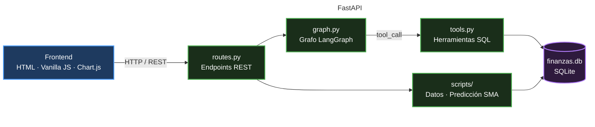
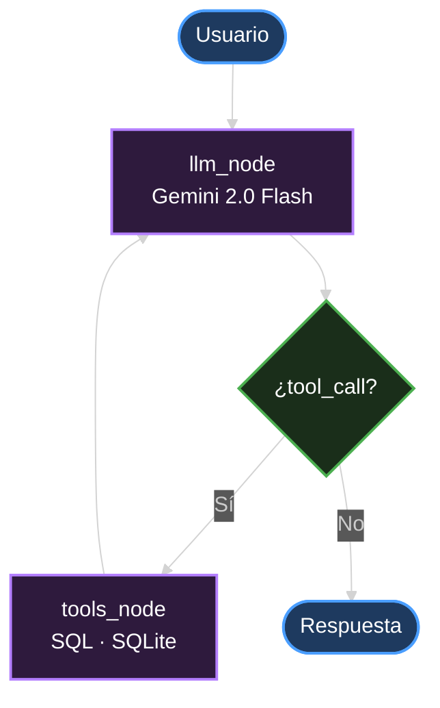
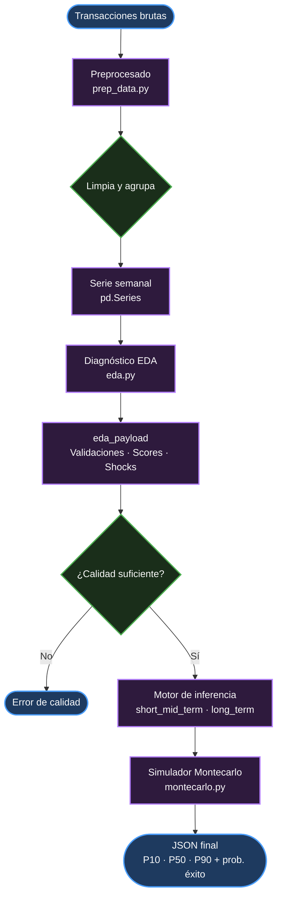

#  Sentinel Finance Engine

> Tu asistente financiero personal impulsado por IA generativa. Conversa en lenguaje natural sobre tus finanzas y recibe análisis, diagnósticos y recomendaciones en tiempo real — todo desde tus propios datos.

🔗 **Demo en vivo:** [martasolerebri.github.io/sentinel-finance-engine](https://martasolerebri.github.io/sentinel-finance-engine/)  

> Necesitarás una API Key de [Google AI Studio](https://aistudio.google.com/app/apikey) (gratuita) para usar el chat.

---

## Visión

Las apps bancarias llevan años estancadas en el mismo modelo: dashboards de solo lectura con filtros predefinidos. Puedes ver tus datos, pero no puedes razonar sobre ellos.

Este proyecto explora si un agente LLM con memoria y herramientas puede transformar la interacción con datos financieros personales, pasando de dashboards pasivos a un asistente que razona, consulta su base de datos y responde con empatía.

---

## Funcionalidades

- **Agente conversacional** — Pregunta en lenguaje natural, el agente consulta tu base de datos y responde con contexto
- **Dashboard financiero** — Donut de gastos por categoría, balance ingresos/gastos y top 5 gastos, filtrables por periodo
- **Objetivo de ahorro** — Barra de progreso con métricas en tiempo real, editable desde la propia interfaz
- **Predicción SMA** — Estimación de gasto para la próxima semana basada en los últimos 30 días

---

## Estado del proyecto

| Capa | Estado | Descripción |
|---|---|---|
| **MVP** | Conectado y funcional | Agente conversacional, dashboard y gestión de objetivos integrados end-to-end |
| **PoC** | Aislado en `backend/PoC/` | Motor predictivo completo (preprocesado → EDA → forecasting → Montecarlo), pendiente de integración |

---

## Cómo funciona

El frontend es una aplicación estática que habla con una API FastAPI. Dentro de la API vive el agente: ante cada mensaje del usuario, decide si responder directamente o lanzar una consulta SQL.



### Agente LangGraph

El núcleo es un grafo reactivo sobre `gemini-2.0-flash`. Dos nodos, un ciclo simple:



El agente dispone de **7 herramientas** que consultan SQLite bajo demanda:

| Herramienta | Qué hace |
|---|---|
| `get_gastos_periodo` | Gasto total por categoría para un periodo |
| `get_evolucion_categoria` | Serie temporal mensual de una categoría |
| `get_resumen_ingresos_vs_gastos` | Balance ingresos / gastos / ahorro |
| `get_progreso_objetivo` | Estado del objetivo de ahorro activo |
| `get_top_gastos` | Top N conceptos individuales con mayor importe |
| `get_ratio_endeudamiento` | Ratio (vivienda + deudas) / ingresos |
| `evaluar_presupuesto_50_30_20` | Diagnóstico según la regla 50/30/20 |

Periodos aceptados: `semana`, `mes`, `trimestre`, `semestre`, `anual` — todos como ventanas deslizantes desde hoy.

---

## Datos y limitaciones

### Datos sintéticos para la demo

La demo no usa datos bancarios reales. Al arrancar, el script `generar_datos.py` produce **18 meses de transacciones sintéticas** con semilla fija (`SEED = 42`), lo que garantiza que todos los usuarios vean exactamente el mismo perfil financiero ficticio y que los resultados sean reproducibles.

Las transacciones simulan un perfil realista de usuario español: supermercados (Mercadona, Lidl, Consum), restaurantes (Glovo, Uber Eats, Starbucks), suscripciones recurrentes, nómina mensual y gastos de vivienda. Los importes se generan con distribuciones aleatorias dentro de rangos por categoría, y se introduce ruido intencional (conceptos mal escritos, duplicados, categorías ambiguas) para que el pipeline de limpieza y categorización tenga algo que hacer.

Esto tiene implicaciones directas en lo que el agente puede y no puede responder: trabaja siempre sobre el mismo dataset estático.

### Por qué no Open Banking real

En producción, la fuente natural de datos sería **Open Banking**: el estándar PSD2 obliga a los bancos europeos a exponer APIs que permiten, con el consentimiento explícito del usuario, leer transacciones, saldos y movimientos en tiempo real. Proveedores como [Tink](https://tink.com) (adquirido por Visa) ofrecen capas de agregación que normalizan las APIs de cientos de bancos en un único contrato.

Como el objetivo del proyecto es demostrar la capa de razonamiento, no la ingesta de datos, descartamos esta vía. Los datos sintéticos permiten centrarse en la construcción de la arquitectura del agente sin distracciones.

### Decisiones de diseño demo vs. producción

Algunas elecciones que en producción serían distintas:

| Aspecto | Demo | Producción |
|---|---|---|
| **Fuente de datos** | SQLite con datos sintéticos generados localmente | Open Banking (PSD2) vía agregador; sincronización incremental |
| **API Key del LLM** | La introduce el usuario en el frontend; se guarda en `localStorage` | Gestionada en backend como secreto de entorno; el usuario no la ve |
| **Persistencia** | SQLite en disco local (o efímero en el container) | Base de datos por usuario con aislamiento real (PostgreSQL + RLS) |
| **Autenticación** | Ninguna | OAuth2 / JWT; cada usuario solo accede a sus datos |
| **Predicción** | SMA síncrona sobre los últimos 30 días | Pipeline PoC en worker asíncrono con caché de resultados |
| **CORS** | Abierto a `localhost:5500` y GitHub Pages | Restringido al dominio de producción |

### Privacidad y seguridad de datos

Dado que la demo usa datos completamente ficticios, no hay PII en ningún punto del sistema. Aun así, hay dos consideraciones relevantes:

**API Key en el cliente.** La clave de Gemini se almacena en `localStorage` del navegador y se envía en cada petición al backend, que la usa para inicializar el agente. Esto es aceptable para una demo personal, pero en producción la clave nunca debería salir del servidor: el backend gestionaría la sesión del LLM de forma opaca para el frontend.

**Datos en Hugging Face Spaces.** El backend corre en un Space público. El container es efímero: cada reinicio regenera la base de datos desde cero. No hay almacenamiento persistente de ningún tipo de conversación o dato financiero entre sesiones.

---

## Deployment

La arquitectura de despliegue separa estáticamente el frontend del backend para simplificar la operación y aprovechar las capas gratuitas de cada plataforma.

```
┌─────────────────────────────┐        ┌──────────────────────────────────┐
│   GitHub Pages              │        │   Hugging Face Spaces            │
│                             │        │                                  │
│   frontend/                 │──HTTP──▶   FastAPI (uvicorn :7860)        │
│   index.html · app.js       │        │   + SQLite (efímero)             │
│   api.js · style.css        │        │   + Agente LangGraph             │
│                             │        │                                  │
│   SPA estática              │        │   Docker container               │
│   Sin build step            │        │   python:3.11-slim               │
└─────────────────────────────┘        └──────────────────────────────────┘
```

**Frontend → GitHub Pages**

El frontend es HTML + Vanilla JS puro, sin bundler ni framework. GitHub Pages lo sirve directamente desde la rama `main` sin ningún paso de compilación. La URL de la API del backend se configura en `api.js`.

**Backend → Hugging Face Spaces**

El backend corre como un Space de tipo Docker. El `Dockerfile` en la raíz del repositorio parte de `python:3.11-slim`, instala las dependencias de `backend/requirements.txt`, y arranca uvicorn en el puerto `7860` (el estándar de Spaces):

Al iniciar el container, `app.py` llama a `generar_datos.py` y construye la base de datos SQLite en `/app/data/finanzas.db`. 

---

## Instalación local

1. **Clona el repositorio**
   ```bash
   git clone https://github.com/martasolerebri/sentinel-finance-engine.git
   cd sentinel-finance-engine
   ```

2. **Instala dependencias**
   ```bash
   cd backend
   pip install -r requirements.txt
   ```

3. **Genera datos de demo**
   ```bash
   python scripts/generar_datos.py
   ```

4. **Arranca el servidor**
   ```bash
   uvicorn app:app --reload --port 8000
   ```

5. **Abre el frontend**

   Abre `frontend/index.html` con Live Server en el puerto `5500`. Al cargar pedirá tu API Key de Gemini; una vez introducida se guarda en `localStorage`.

> **CORS:** el backend acepta peticiones desde `localhost:5500` y `127.0.0.1:5500`. Si usas otro puerto, cambia `ORIGENES_PERMITIDOS` en `app.py`.

La documentación interactiva de la API está en `http://localhost:8000/docs`.

---

## PoC — Motor predictivo avanzado

> **Ubicación:** `backend/PoC/` — autónomo, no conectado al MVP.

El MVP usa una Media Móvil Simple para predecir el gasto semanal: rápida, sin dependencias, suficiente para el ciclo de demo. La PoC va un nivel más arriba: pipeline estadístico completo con selección automática de modelo, forecasting con intervalos de confianza y simulación Montecarlo.

Está desconectada porque el pipeline tarda demasiado para ejecutarse síncronamente junto a las peticiones del usuario. Integrarlo bien requiere un worker separado y un canal asíncrono entre ambos — el siguiente paso natural.



Más detalle en [`backend/PoC/README.md`](backend/PoC/README.md).

---

## Project Structure

```
sentinel-finance-engine/
├── Dockerfile              # Build para Hugging Face Spaces
├── frontend/
│   ├── index.html          # Dashboard + chat flotante
│   ├── app.js              # Lógica de UI y renderizado
│   ├── api.js              # Capa de red (fetch al backend)
│   └── style.css           # Estilos
│
└── backend/
    ├── app.py              # Entrada FastAPI + inicialización de BD
    ├── requirements.txt    # Dependencias Python
    ├── utils.py            # Periodos, fechas y DB_PATH compartidos
    ├── api/
    │   └── routes.py       # Endpoints REST
    ├── agent/
    │   ├── graph.py        # Grafo LangGraph + caché por api_key
    │   ├── tools.py        # 7 herramientas SQL del agente
    │   └── state.py        # Estado tipado del grafo
    ├── scripts/
    │   ├── generar_datos.py    # Generador de transacciones sintéticas
    │   ├── categorizar.py      # Etiquetado de conceptos por categoría
    │   └── predicciones.py     # Predicción SMA 30 días
    ├── data/
    │   └── finanzas.db     # SQLite (se genera en runtime)
    └── PoC/                # Motor predictivo avanzado (aislado)
        ├── README.md
        └── src/
            ├── preprocessing/
            ├── controllers/
            ├── models/
            ├── simulators/
            └── utils/
```

---

## Autores

[Juan Luis German Saura](https://github.com/ygs1629), [Flor Sastre](https://github.com/florsastre-gif), [Marta Soler Ebri](https://github.com/martasolerebri) — Master's Degree Project
