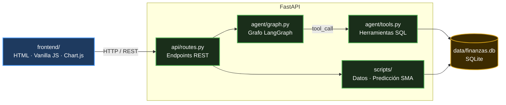
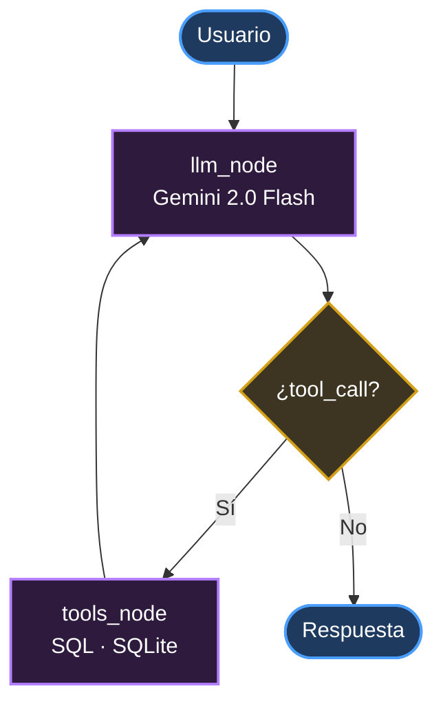
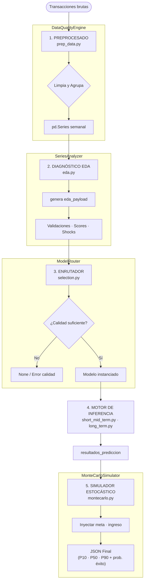

# Sentinel Finance Engine

Asistente financiero personal impulsado por IA generativa. El usuario conversa en lenguaje natural sobre sus finanzas y recibe análisis, diagnósticos y recomendaciones en tiempo real, todo respaldado por sus propios datos de transacciones.

---

## Índice

1. [Visión del proyecto](#visión-del-proyecto)
2. [MVP — Sistema conectado end-to-end](#mvp--sistema-conectado-end-to-end)
   - [Arquitectura](#arquitectura)
   - [Backend](#backend)
   - [Frontend](#frontend)
   - [Puesta en marcha](#puesta-en-marcha)
3. [PoC 1.0 — Motor predictivo avanzado (aislado)](#poc-10--motor-predictivo-avanzado-aislado)
   - [Pipeline ML](#pipeline-ML)
4. [Estructura del repositorio](#estructura-del-repositorio)

---

## Visión del proyecto

El proyecto explora cómo los **agentes LLM con memoria y herramientas** pueden transformar la interacción con datos financieros personales, pasando de dashboards pasivos a un asistente que razona, consulta su base de datos y responde con empatía.

El contexto lo hace especialmente relevante: la banca retail acumula un retraso significativo en la adopción de IA generativa de cara al usuario final, en parte por las barreras regulatorias propias del sector y en parte por la inercia de unas apps bancarias cuya funcionalidad se limita normalmente a dashboards de solo lectura con filtros predefinidos. Ese hueco entre lo que la tecnología permite y lo que el usuario final recibe es la oportunidad que este proyecto explora.

El estado de este proyecto actualmente se divide en dos capas claramente diferenciadas:

| Capa | Estado | Descripción |
|---|---|---|
| **MVP** | ✅ Conectado y funcional | Conversación, dashboard y gestión de objetivos integrados |
| **PoC 1.0** | 🔬 Aislado en `backend/PoC/` | 1ª versión de un motor predictivo (preprocesado → EDA → forecasting → Montecarlo) |

---

## MVP — Sistema conectado end-to-end

### Arquitectura



### Backend

#### Agente LangGraph + Gemini 2.0 Flash

El núcleo del sistema es un **grafo reactivo** construido con LangGraph sobre `gemini-2.0-flash`. El agente alterna entre dos nodos:

- **`llm`** — Recibe el mensaje del usuario y decide si responder directamente o llamar a una herramienta.
- **`tools`** — Ejecuta la herramienta SQL correspondiente y devuelve el resultado al LLM.

El historial de conversación se gestiona automáticamente mediante `MemorySaver`, usando el `user_id` como `thread_id`. El grafo se cachea por `api_key`, compilándose una sola vez por sesión.



#### Herramientas del agente (`agent/tools.py`)

El agente dispone de **7 herramientas** que consultan SQLite bajo demanda:

| Herramienta | Descripción |
|---|---|
| `get_gastos_periodo` | Gasto total por categoría para un periodo |
| `get_evolucion_categoria` | Serie temporal mensual de una categoría |
| `get_resumen_ingresos_vs_gastos` | Balance ingresos / gastos / ahorro |
| `get_progreso_objetivo` | Estado del objetivo de ahorro activo |
| `get_top_gastos` | Top N conceptos individuales más caros |
| `get_ratio_endeudamiento` | Ratio vivienda + deudas / ingresos |
| `evaluar_presupuesto_50_30_20` | Diagnóstico según la regla 50/30/20 |

Los periodos reconocidos son: `semana`, `mes`, `trimestre`, `semestre` y `anual`.

#### API REST (`api/routes.py`)

| Método | Ruta | Descripción |
|---|---|---|
| `GET` | `/api/dashboard` | Gastos por categoría (gráfico donut) |
| `GET` | `/api/resumen` | Balance ingresos / gastos / ahorro |
| `GET` | `/api/top-gastos` | Top N gastos del periodo |
| `GET` | `/api/objetivo` | Objetivo de ahorro activo |
| `GET` | `/api/predicciones` | Predicción de gasto (SMA 30 días) |
| `POST` | `/api/chat` | Invocar el agente LangGraph |
| `POST` | `/api/objetivos` | Crear o reemplazar el objetivo |

La API Key de Google AI (Gemini) viaja en cada petición como `Authorization: Bearer <key>` y **nunca se almacena en el servidor**.

#### Base de datos

SQLite local con dos tablas inicializadas automáticamente al arrancar:

- **`transacciones`** — `fecha`, `concepto`, `importe`, `categoria`
- **`objetivos`** — `nombre`, `importe_objetivo`, `importe_actual`, `fecha_limite`

Los datos de demostración se generan con `scripts/generar_datos.py` y se categorizan con `scripts/categorizar.py`.

### Frontend

Interfaz de una sola página construida con **HTML + Vanilla JS + Chart.js**.

**Componentes principales:**

- **Dashboard** — Tarjetas de resumen (ingresos, gastos, ahorro neto), gráfico donut de distribución de gastos por categoría, tabla de detalle y top 5 gastos. Filtrable por periodo con un solo clic.
- **Objetivo de ahorro** — Barra de progreso con métricas en tiempo real (ahorrado, falta, días restantes). Editable desde la propia interfaz.
- **Chat flotante** — Ventana de conversación con el agente. La API Key se solicita al inicio y se guarda en `localStorage`; el backend nunca la persiste.

### Puesta en marcha

#### Requisitos previos

- Python 3.11+
- Una API Key de [Google AI Studio](https://aistudio.google.com/app/apikey) (Gemini 2.0 Flash)
- Extensión **Live Server** en VS Code (o cualquier servidor HTTP estático)

#### Backend

```bash
# 1. Instalar dependencias
cd backend
pip install -r requirements.txt

# 2. Generar datos de ejemplo (opcional)
python scripts/generar_datos.py

# 3. Arrancar el servidor
uvicorn app:app --reload --port 8000
```

La API quedará disponible en `http://localhost:8000`. La documentación interactiva en `http://localhost:8000/docs`.

#### Frontend

Abrir `frontend/index.html` con Live Server (puerto `5500`). Al cargar, la aplicación solicitará la API Key de Google AI; una vez introducida se almacena en `localStorage` y no vuelve a pedirse.

> **CORS**: el backend solo acepta peticiones desde `localhost:5500` / `127.0.0.1:5500`. Si usas otro puerto, actualiza `ORIGENES_PERMITIDOS` en `app.py`.

---

## PoC 1.0 — Motor predictivo avanzado (aislado)

> **Ubicación:** `backend/PoC/`
>
> Este módulo es **completamente autónomo**: no está conectado al MVP actual. Representa el siguiente salto evolutivo del sistema.

El PoC implementa un **pipeline estadístico y predictivo completo** sobre el histórico de transacciones del usuario. Su objetivo es pasar de la predicción simple del MVP a un sistema de forecasting con intervalos de confianza y simulación de escenarios, para otorgar más valor al asistente y facilitar pronósticos más precisos al usuario.

Su desconexión del MVP responde a una limitación arquitectónica: el pipeline de forecasting consume demasiado tiempo de cómputo para ejecutarse de forma síncrona en el mismo proceso que atiende las peticiones del usuario. La integración requiere desacoplarlo en un proceso separado y establecer un servicio intermediario que conecte ambos — el proceso principal lo invoca cuando lo necesita y recibe el resultado de forma asíncrona, sin bloquear la interfaz ni dejar al usuario esperando.

### Pipeline ML



Para una descripción más detallada, consultar:  [`backend/PoC/README.md`](backend/PoC/README.md).

---

## Estructura del repositorio

```
ia-project-2/
├── frontend/
│   ├── index.html          # SPA — Dashboard + chat flotante
│   ├── app.js              # Lógica de UI y renderizado
│   ├── api.js              # Capa de comunicación con el backend
│   └── style.css           # Estilos
│
└── backend/
    ├── app.py              # Punto de entrada FastAPI
    ├── requirements.txt    # Dependencias Python
    ├── utils.py            # Utilidades compartidas (fechas, periodos)
    ├── api/
    │   └── routes.py       # Endpoints REST
    ├── agent/
    │   ├── graph.py        # Grafo LangGraph
    │   ├── tools.py        # Herramientas SQL del agente
    │   └── state.py        # Estado tipado
    ├── scripts/
    │   ├── generar_datos.py    # Generador de transacciones sintéticas
    │   ├── categorizar.py      # Categorizador de conceptos
    │   └── predicciones.py     # Predicción SMA (MVP)
    ├── data/
    │   └── finanzas.db     # Base de datos SQLite (generada en runtime)
    └── PoC/                # ← Motor predictivo avanzado (AISLADO)
        ├── README.md       # Documentación técnica detallada
        └── src/
            ├── preprocessing/  # prep_data.py · eda.py
            ├── controllers/    # selection.py · long_term.py
            ├── models/         # short_mid_term.py · transformers.py
            ├── simulators/     # montecarlo.py
            └── utils/
```
