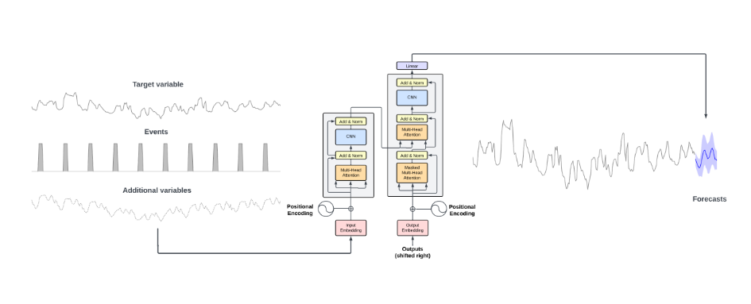

# 💰 Asistente Financiero Virtual con IA

---

## 🏗️ Arquitectura

| Capa | Tecnología | Despliegue |
|------|-----------|------------|
| Frontend | HTML / CSS / JS vanilla | GitHub Pages |
| Backend + Agente | FastAPI + LangGraph | Hugging Face Spaces |
| Base de datos | SQLite | Incluida en el repo del backend |
| LLM | OpenAI (API Key del usuario) | — |

---

## ✨ Funcionalidades

- **Categorización automática** — El LLM clasifica los conceptos bancarios en categorías cerradas (Vivienda, Supermercado, Restaurantes, Ocio, Transporte, Suministros, Salud, Suscripciones, Ingresos, Otros)
- **Dashboard con filtro de periodo** — Visualización de gastos por categoría filtrable por semana, mes, trimestre, semestre y año mediante desplegable
- **Chat conversacional** — Agente LangGraph con acceso a la base de datos para responder preguntas como "¿cuánto he gastado en ocio este mes?"
- **Predicciones** — Cálculo matemático (media ponderada de los últimos 3 meses) del gasto previsto el próximo mes por categoría
- **Objetivos de ahorro** — El usuario define objetivos con importe total y fecha límite; el sistema proyecta si los alcanzará con su ritmo actual
- **Sistema de alertas** — Python detecta las condiciones de alerta y usa el LLM únicamente para redactar el mensaje en lenguaje natural

---

## 📁 Estructura del proyecto

```
/backend                          → Hugging Face Spaces
  app.py                          # Punto de entrada FastAPI
  requirements.txt
  /data
    transacciones_sucias.csv      # Histórico generado (script de uso único)
    finanzas.db                   # SQLite con datos categorizados + objetivos
  /scripts
    generar_datos.py              # Genera el CSV de datos ficticios
    categorizar.py                # Llama al LLM y puebla la DB (uso único)
  /core
    state.py                      # TypedDict del estado de LangGraph
    tools.py                      # Herramientas SQL del agente
    graph.py                      # Grafo LangGraph (nodos + edges)
    predicciones.py               # Lógica de medias ponderadas y proyecciones
    alertas.py                    # Reglas de disparo de alertas + llamada al LLM
  /api
    routes.py                     # Endpoints: /dashboard, /chat, /objetivos

/frontend                         → GitHub Pages
  index.html
  style.css
  app.js                          # Lógica de UI (vistas, eventos)
  api.js                          # Llamadas fetch al backend
  /assets/icons
```

---

## 🚀 Plan de desarrollo

### Semana 1 — Backend funcional

| Día | Fase | Descripción |
|-----|------|-------------|
| 1-2 | Datos sucios | `generar_datos.py` — CSV con 18 meses de transacciones ficticias |
| 3 | Categorización | `categorizar.py` — LLM clasifica el CSV y puebla `finanzas.db` |
| 4 | LangGraph | `tools.py` + `graph.py` — Agente con acceso SQL, testeable desde terminal |
| 5 | Predicciones y alertas | `predicciones.py` + `alertas.py` — medias ponderadas, proyección de objetivos y reglas de alerta |

### Semana 2 — Frontend y despliegue

| Día | Fase | Descripción |
|-----|------|-------------|
| 6-7 | FastAPI | `routes.py` — Endpoints `/dashboard`, `/chat`, `/objetivos` con CORS |
| 8-9 | Frontend | Dashboard (Chart.js), chat con burbujas, modal de API Key |
| 10 | Objetivos | Formulario de alta de objetivos + tarjetas de progreso |
| 11-12 | Despliegue | Dockerfile para HF Spaces + GitHub Pages |
| 13-14 | Buffer | Bugs, pulido y preparación de la demo |

---

## 🔑 Gestión de la API Key

El usuario introduce su propia API Key en el frontend. El flujo es:

1. Al entrar a la app, un modal solicita la API Key si no existe en `localStorage`
2. Cada petición al backend incluye la key en el header: `Authorization: Bearer <key>`
3. El backend instancia el LLM con esa key y la descarta — **nunca se almacena en el servidor**

---

## 🔌 Endpoints de la API

| Método | Ruta | Descripción |
|--------|------|-------------|
| `GET` | `/api/dashboard?periodo=mes` | Gastos por categoría del periodo elegido + predicción + alerta activa |
| `POST` | `/api/chat` | Mensaje al agente LangGraph (API Key en header) |
| `GET` | `/api/objetivos` | Lista los objetivos con su estado de progreso |
| `POST` | `/api/objetivos` | Crear o actualizar un objetivo de ahorro |

El parámetro `periodo` del dashboard acepta: `semana`, `mes`, `trimestre`, `semestre`, `anual`.

---

## 🧠 Diseño del grafo LangGraph

El grafo es intencionalmente simple: **un nodo principal con tools**. El LLM recibe el mensaje, decide si necesita consultar datos, ejecuta la tool correspondiente, recibe el resultado y responde. No hay routers complejos ni nodos separados por intención.

```
[usuario] → [nodo LLM] → ¿tool necesaria? → SÍ → [ejecutar tool] → [nodo LLM] → [respuesta]
                                           → NO → [respuesta]
```

### Tools disponibles para el agente

| Tool | Descripción |
|------|-------------|
| `get_gastos_periodo(periodo, año)` | Gastos totales por categoría para el periodo indicado |
| `get_evolucion_categoria(categoria, meses)` | Serie temporal de una categoría (últimos N meses) |
| `get_resumen_ingresos_vs_gastos(periodo)` | Balance neto: ingresos, gastos y ahorro del periodo |
| `get_progreso_objetivo(nombre)` | Estado de un objetivo: acumulado, falta, días restantes |
| `get_top_gastos(periodo, n)` | Los N conceptos individuales más caros del periodo |

> **Principio clave:** el LLM nunca hace cálculos. Recibe los números ya calculados por Python y solo redacta la respuesta en lenguaje natural.

---

## 📈 Predicciones

La predicción de gasto mensual se calcula con una **media ponderada de los últimos 3 meses**, dando más peso al mes más reciente:

```
gasto_previsto = (mes_anterior × 0.5) + (hace_2_meses × 0.3) + (hace_3_meses × 0.2)
```

Este cálculo se realiza **por categoría** de forma independiente. El resultado se muestra en el dashboard como una barra o columna de "previsto" junto al gasto real del mes en curso, permitiendo ver de un vistazo si se está por encima o por debajo de lo habitual.

---

## 🎯 Objetivos de ahorro y proyección

Los objetivos son de tipo ahorro: el usuario indica cuánto quiere acumular y para cuándo. La proyección funciona así:

```python
ahorro_mensual_medio = media((ingresos - gastos) de los últimos 3 meses)
meses_restantes      = (fecha_limite - hoy) en meses
proyeccion_total     = importe_actual + (ahorro_mensual_medio × meses_restantes)
```

Si `proyeccion_total >= importe_objetivo` → el usuario va bien encaminado.
Si no → `deficit = importe_objetivo - proyeccion_total` y se genera una alerta.

### Esquema de la tabla `objetivos`

```sql
objetivos (
  id              INTEGER PRIMARY KEY,
  nombre          TEXT,       -- ej. "Vacaciones de verano"
  importe_objetivo REAL,      -- cuánto quiere ahorrar en total
  importe_actual  REAL,       -- cuánto lleva ahorrado hasta hoy
  fecha_limite    DATE        -- fecha objetivo
)
```

---

## 🚨 Sistema de alertas

Python decide **cuándo** se dispara una alerta. El LLM solo recibe los datos ya calculados y redacta el mensaje (máximo 3 líneas, empático, con una sugerencia concreta). Hay tres tipos:

### 1. Alerta de objetivo en riesgo
Se dispara cuando la proyección no alcanza el 90% del importe objetivo:
```
proyeccion_total < importe_objetivo × 0.9
```

### 2. Alerta de categoría disparada
Se dispara cuando el gasto de una categoría en lo que va de mes supera en más del 30% su media de los últimos 3 meses:
```
gasto_categoria_mes_actual > media_3_meses_categoria × 1.3
```
Evita falsos positivos por pequeñas desviaciones puntuales.

### 3. Alerta de balance negativo proyectado
Se dispara cuando la proyección de gasto total del mes supera los ingresos habituales:
```
gasto_previsto_mes > media_ingresos_3_meses
```

Cuando se dispara una alerta, se construye un `dict` con los datos numéricos concretos (déficit en euros, categorías implicadas, porcentaje de desviación) y se pasa al LLM como contexto para que redacte el mensaje. La función devuelve siempre:
```python
{
  "alerta": bool,
  "tipo": str,           # "objetivo" | "categoria" | "balance"
  "mensaje": str,        # redactado por el LLM
  "proyeccion_euros": float
}
```

---

## ⚙️ Instalación local (backend)

```bash
git clone <repo-backend>
cd backend
pip install -r requirements.txt

# Paso 1: Generar datos ficticios
python scripts/generar_datos.py

# Paso 2: Categorizar con el LLM (requiere OPENAI_API_KEY)
export OPENAI_API_KEY=sk-...
python scripts/categorizar.py

# Paso 3: Lanzar la API
uvicorn app:app --reload
```

---

## ⚠️ Notas importantes

- El almacenamiento en Hugging Face Spaces (versión gratuita) es **efímero**. La `finanzas.db` y el CSV deben estar commiteados en el repositorio para que se restauren al despertar el Space.
- Para desarrollo local del frontend, cambiar la `BASE_URL` en `api.js` a `http://localhost:8000`.
- Toda la lógica numérica (promedios, proyecciones, comparaciones) vive en Python. El LLM nunca calcula, solo redacta.


## Ilustración del transfomer financiero usado (TimesGPT)

