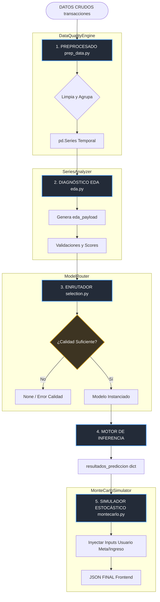

# Pipeline para integración

### STEP 1: Preprocesamiento y Calidad del Dato
* **Módulo:** `src/preprocessing/prep_data.py`
* **Clase Principal:** `DataQualityEngine`
* **Entrada:** DataFrame crudo con el histórico de transacciones del usuario.
* **Ejecución:** Se llama a la función `get_resampled_series()`, la cual internamente ejecuta `treat_outliers()`.
* **Salida (Return):** Una `pd.Series` temporal limpia, suavizada y estructurada semanalmente.

---

### STEP 2: Diagnóstico y Gobernanza (EDA)
* **Módulo:** `src/preprocessing/eda.py`
* **Clase Principal:** `SeriesAnalyzer`
* **Entrada:** La `pd.Series` generada en el Step 1.
* **Ejecución:** Se instancia la clase y se llama a la función `run_analysis()`.
* **Salida (Return):** Un diccionario (`eda_payload`) con los metadatos de la serie, scores de estabilidad, detección de shocks y una validación booleana (`valido_para_prediccion`).

---

### STEP 3: Enrutamiento Algorítmico (Model Router)
* **Módulo:** `src/controllers/selection.py`
* **Clase Principal:** `ModelRouter`
* **Entrada:** La `pd.Series` (Step 1) y el diccionario `eda_payload` (Step 2).
* **Ejecución:** Se llama a la función `get_forecaster()`, que internamente evalúa `determine_architecture()`.
* **Salida (Return):** Devuelve la instancia del modelo predictivo correcto (`TimeForecaster` o `TransformerModel`), listo para ser ejecutado.

---

### STEP 4: Inferencia y Predicción
* **Módulo:** `src/models/short_mid_term.py` o `src/models/transformers.py`
* **Clases:** `TimeForecaster` / `TransformerModel`
* **Entrada:** La instancia generada en el Step 3.
* **Ejecución:** Se llama a la función principal `run_forecast()`.
* **Salida (Return):** Un diccionario (`resultados_prediccion`) que contiene las listas de fechas futuras, predicciones puntuales medias, límite inferior, límite superior y la métrica de fiabilidad.

---

### STEP 5: Simulación Estocástica (Montecarlo)
* **Módulo:** `src/simulators/montecarlo.py`
* **Clase Principal:** `MonteCarloSimulator`
* **Entrada:** El diccionario `resultados_prediccion` (Step 4), la meta de ahorro (ej. 3000€) y el ingreso semanal fijo del usuario.
* **Ejecución:** Se llama a la función ejecutar_simulacion().
* **Salida (Return):** Un diccionario (JSON final) con la Probabilidad de Éxito (%), y la proyección del ahorro en tres escenarios (Pesimista P10, Central P50, Optimista P90).

# Grafo de flujo

# Infografía

---
# Reporte en versión extendida por archivo

## 1º STEP -> `src/preprocessing/prep_data.py`

### 1. Justificación

**Agregación Temporal (remuestreo semanal + relleno con ceros)**  
Fundamento: filtrar el ruido blanco diario y estabilizar la señal.

**Manejo de Nulos**: mantener integridad y fidelidad del comportamiento. Interpolar asumiría un gasto continuo inexistente que contaminaría los datos.

**Winsorización Selectiva Bidimensional**:  
Fundamento: mitigar la asimetría severa de las distribuciones de gasto sin destruir base estructural del usuario. "Topar" gastos atípicos usando el percentil 98 de los gastos extraordinarios.

**Regla**: Un gasto se considera estructural si simultáneamente tiene una frecuencia total >= 3 veces en el histórico de gastos y CV =< 15%.

### 2. Limitaciones actuales

- **Rigidez en las entidades**: La limpieza léxica basada en expresiones regulares (`r'[0-9/]'`) es frágil y muy estricta.
- **Filtros universales**: Aplicar un límite estático del percentil 98 o un umbral de CV del 15% de forma global a todos los usuarios asume una homogeneidad irreal.

### 3. Futuros pasos

- **Asignación Dinámica de Hiperparámetros por Clúster**: Sustituir las variables estáticas (CV, percentil, frecuencia temporal) por parámetros condicionados. Una fase previa de clustering no supervisado sobre las series temporales determinará qué umbrales se aplican a cada grupo.
- **Entity Resolution mediante NLP**: Reemplazar la limpieza Regex por técnicas de embedding de texto o modelos ligeros de clasificación que estandarice los conceptos bancarios sucios en familias categóricas puras antes de calcular la varianza.
- **Cálculo de Límites en Ventana Deslizante**: Para eliminar cualquier future data leakage, los parámetros de winsorización deberán calcularse mediante ventanas temporales que se actualicen iterativamente, deslizándose sobre la progresión temporal.

---

## 2º STEP -> `src/preprocessing/eda.py`

### 1. Justificación

- **Filtro de densidad >80%**: Asegurar que las series que lleguen a ser candidatas para el modelado tengan mínimo de semanas con gastos registrados, para asegurar que los modelos no memoricen ceros.
- **Evaluación estacionariedad**  
  Fundamento: Combinar ADF (H0 = "random walk", no permanece cerca de la media) con la prueba KPSS (H0 = la serie es estable) permite una clasificación estricta sobre la estabilidad de la media y varianza.
- **Uso de Zivot-andrews**. Si la serie no es estacionaria, esto sirve para evaluar si la serie ha tenido un efecto escalón o no (posible prueba de un cambio de régimen, p.ej: mudarse de hogar)
- **Descomposición STL y auditoría de residuos (test de ruido blanco)**:  
  Fundamento: STL (Seasonal and Trend decomposition using Loess) permite sacar la magnitud de la tendencia, estacionalidad y ruido, para poder valorar qué dimensión empuja el comportamiento del gasto. Se aplica el test de Ljung-Box a los residuos. Si el p-valor es >0.05, los residuos son ruido blanco (independientes), lo que demuestra que la tendencia y la estacionalidad han extraído toda la señal útil del comportamiento del usuario.

### 2. Limitaciones

- **Métodos de descomposición de componentes**: el uso de STL puede fallar en las series más erráticas (más ruidosas que fallan el test del ruido blanco). La transición a técnicas de estacionalidad múltiple simultánea sería el siguiente paso (MSTL).
- **Variables exógenas**: carecer de inclusión de variables que pueden aportar señal y patrones en los datos es una opción explotable a futuro (variables de calendario/macroeconómicas y feature engineering para los modelos cortoplacistas).
- **Filtro de Densidad Binario**: El umbral del 80% puede ser muy estricto. Realizar comprobaciones del comportamiento de la serie sobre aquellos que tienen una densidad cercana pero no igual al 80% sería el siguiente paso, explorar antes de descartar según parámetros más flexibles.

### 3. Futuros pasos

- **Modelado de registros intermitentes**: Para aquellos usuarios que no superen el filtro de densidad, en lugar de rechazar la predicción, se dispondrá de modelos probabilísticos de intermitencia
- **Alertas Activas de Rotura Estructural**: Si se detecta un quiebre reciente (p-valor < 0.05 en Zivot Andrews), el sistema recortará el histórico de entrenamiento para que el modelo predictivo sólo aprenda de la nueva realidad del usuario, ignorando el comportamiento obsoleto. Comunicación por LLM agente al usuario para confirmación.

---

## 3º STEP -> `src/controllers/selection.py`

### 1. Justificación

- **Asignación algorítmica por longitud de histórico**:  
  Fundamento: Prevención del sobreajuste y eficiencia algorítmica. Modelos complejos como Prophet requieren al menos un ciclo semestral/anual para ajustar sus series de Fourier, mientras que los Transformers financieros (TSFM) en zero-shot necesitan ver la estacionalidad completa. Restringir series cortas a modelos más simples asegura predicciones más estables.
- **Mitigación de roturas estructurales**:  
  Fundamento: Asignación basada según EDA. Si se detecta quiebre, se recorta la serie, se invoca un algoritmo simple (ETS) y se penaliza la confianza de la predicción.

### 2. Limitaciones

- **Recorte estático y ciego**: El recorte de la serie arbitrariamente a las últimas 12 semanas, independientemente de cuándo sucedió, ignorando el comienzo del nuevo régimen.
- **Umbrales de asignación de algoritmos rígidos**: Las fronteras de decisión (12, 24, 52 semanas) son estáticas. Saltos abruptos que no consideran el contexto histórico.
- **ETS forzado**: en cualquier rotura estructural asume que el usuario siempre está en una fase de alta incertidumbre a corto plazo. Si el usuario sufrió un shock hace un año y medio (y desde entonces tiene un historial denso y estable), forzar ETS limitará drásticamente la capacidad de predecir a 6 o 12 meses vista.

### 3. Futuros pasos

- **Recorte Dinámico Basado en el momento del quiebre**: El test de Zivot-Andrews en la capa EDA debe extraer y transmitir el índice temporal exacto donde ocurrió la rotura estructural.
- **Elección del mejor modelo**: En lugar de utilizar reglas duras if-else, instanciar una serie de modelos para el mismo horizonte y perfil y seleccionar el mejor (mín f.pérdidas)

---

## 4º STEP -> `src/models/short_mid_term.py`

### 1. Justificación

- **Manejo de la inestabilidad**  
  Fundamento: implementa una ecuación de riesgo ponderada (EDA, modelo y techo). Objetivo de proteger al usuario de falsas expectativas de ahorro.
- **Ajuste Bayesiano y Sensibilidad en Prophet**:  
  Fundamento: activación de inferencia bayesiana, lo que proporciona intervalos de incertidumbre, haciendo simulación de escenarios condicionales en los tres niveles de la serie para dar los intervalos de predicción
- **Sensibilidad**: Aumentar el changepoint_prior_scale a 0.15 permite que el modelo reaccione más rápido a los cambios recientes en los hábitos de consumo del usuario.
- **Exogeneidad de Calendario**: La inyección nativa de festividades locales (country_holidays='ES') permite capturar picos anómalos pero predecibles (ej. Navidades, Semana Santa) sin confundirlos con cambios de tendencia estructurales.
- **Cota inferior no negativa**  
  Fundamento: El gasto financiero no puede tener valores absolutos negativos.

### 2. Limitaciones

- **Cuello de Botella Computacional (MCMC)**: Ejecutar inferencia MCMC con 50 iteraciones para el modelo de cada usuario individual tiene una latencia alta. Es insostenible en un entorno real.
- **Carencia Probabilística en ETS**: La implementación actual de ExponentialSmoothing genera predicciones puntuales (point forecasts), pero devuelve None en los límites de confianza. Al carecer de varianza estimada, se fuerza una "estabilidad de modelo" fija de 0.5.
- **Estacionalidad Mensual Rígida**: En Prophet, forzar una estacionalidad de period=30.5 con fourier_order=5 de forma global asume que todos los usuarios tienen ciclos intra-mensuales idénticos y complejos, lo cual puede generar sobreajuste en series estables.

### 3. Futuros Pasos

- **Inferencia MAP vs. MCMC Condicionada**: Cambiar el muestro de MCMC a unos usuarios exclusivos que tengan volatilidades más altas.
- **Transición a ETS Probabilístico (State Space Models)**: Sustituir la implementación clásica por modelos de espacio de estados lo que permitirá extraer la varianza residual y construir intervalos de predicción rigurosos para las series cortas.
- **Sustitución por modelos de Boosting**: A corto/medio plazo, evaluar el desempeño de modelos globales basados en árboles entrenados y optimizados según clusters, para bajar la latencia.

---

## 5º STEP -> `src/controllers/long_term.py`

### 1. Justificación Técnica

- **Inferencia Zero-Shot mediante Modelos Fundacionales**:  
  Fundamento: Utilizar la API gratis de TimeGPT (Nixtla) delega la inferencia a una arquitectura Transformer preentrenada con miles de millones de puntos de datos temporales. Esto permite capturar estacionalidades anuales complejas y macro-tendencias a un horizonte de 52 semanas sin necesidad de entrenar o ajustar hiperparámetros localmente.
- **Tolerancia a Fallos (fallback)**:  
  Fundamento: si la API falla, el sistema dirige automáticamente la predicción hacia PROPHET_LARGO. Esto garantiza la continuidad del servicio y evita que la interfaz de usuario se bloquee.
- **Coherencia en la Gobernanza de la Incertidumbre**:  
  Fundamento: Reutiliza la función de riesgo híbrida (eda, intervalo del modelado y techo), manteniendo la coherencia. Las cotas inferiores a cero (zero-bounding) se aplican rigurosamente.

### 2. Limitaciones Actuales

- **Opacidad del Modelo (Caja Negra)**: Aunque los modelos fundacionales (TSFM) carecen de interpretabilidad (caja negra), esta limitación arquitectónica se ha mitigado mediante la interpretabilidad de la inferencia según el EDA por un LLM.
- **Latencia de Red Indeterminada**
- **Riesgo Normativo y de Privacidad (Data Privacy)**

### 3. Futuros pasos

- **Soberanía de los datos**: Migrar de la API de TimeGPT a modelos fundacionales de pesos abiertos, como TimesFM o Chronos.
- **Fine-Tuning Adaptativo**: Abandonar el enfoque puramente zero-shot y aplicar técnicas de adaptación paramétrica eficiente (como LoRA) sobre el modelo fundacional. Se entrenará al modelo con el histórico agregado de los clústeres propios del banco, adaptándolo a la semántica y volatilidad específica del mercado local.

---

## 6º STEP -> `src/simulators/montecarlo.py`

### 1. Justificación

- **Transición hacia previsión de riesgo**  
  Fundamento: Las predicciones puntuales son insuficientes para la planificación financiera a largo plazo. Al inyectar ruido estocástico mediante el método de Montecarlo, se permite calcular probabilidades de éxito según simulación de escenarios
- **Ingeniería inversa de varianza**  
  Fundamento: Al carecer de la desviación estándar residual directa de algunos modelos, el código aplica ingeniería inversa sobre el intervalo de confianza del 80%. Esto permite parametrizar la simulación.

### 2. Limitaciones

- **Premisa de normalidad (Riesgo de colas)**: se asume que la distribución de los errores de gasto es simétrica. La distribución normal subestima la probabilidad de que ocurran gastos extremos inesperados, pecando de optimismo algorítmico.
- **Independencia Intertemporal**: El simulador genera el gasto de la semana actual de forma completamente independiente de la anterior. En la realidad del consumidor, el gasto está autocorrelacionado.
- **Ingresos deterministas**: Asumir un ingreso semanal estático y constante es un sesgo restrictivo. Afecta directamente al cálculo del ahorro neto.

### 3. Futuros pasos

- **Transición a distribuciones asimétricas**: Reemplazar el generador Gaussiano por distribuciones que modelen mejor los eventos extremos financieros, como la distribución Log-Normal o la Student.
- **Simulación con Autocorrelación (Cópulas)**: Inyectar dependencia temporal en las trayectorias de Montecarlo.

---

## Principales transiciones del sistema

### 1. Evolución estocástica

**Objetivo**: Eliminar el sesgo determinista en la ecuación de ahorro.

**Justificación**: El MVP asume ingresos constantes, lo cual no refleja la realidad financiera de perfiles autónomos, variables o con alta rotación laboral. El siguiente salto evolutivo consiste en aplicar el mismo rigor predictivo a los ingresos, transformando la simulación de Montecarlo en un sistema estocástico bivariante (Ingresos Simulados vs. Gastos Simulados), capturando el riesgo real del flujo de caja (Cash-Flow) del usuario en su totalidad.

### 2. Escalabilidad Algorítmica mediante Clustering

**Objetivo**: Resolver el cuello de botella computacional del paradigma One-Model-Per-User.

**Justificación**: la arquitectura transicionará hacia un Modelado Global por Cohortes. Mediante técnicas de aprendizaje no supervisado sobre las series temporales (ej. K-Means con distancias DTW), se agrupará a los usuarios en perfiles de comportamiento homogéneo. Esto permite entrenar un único modelo complejo (ej. XGBoost o un Transformer adaptado) por cada clúster, resolviendo el problema del Cold Start para usuarios nuevos e incrementando drásticamente la latencia y sostenibilidad del sistema.

### 3. Madurez Operativa: Infraestructura MLOps

**Objetivo**: Garantizar la gobernanza, auditabilidad y resiliencia del sistema en producción.

**Justificación**: El despliegue de modelos financieros exige abandonar la ejecución estática en favor de un ciclo de vida continuo (CI/CD). Esto implica:

- **Model Registry y Trazabilidad**: Versionado de datos, hiperparámetros y evaluación (MAE, MAPE, etc) mediante herramientas estándar (ej. MLflow).
- **Monitorización de Drift**: Implementación de observabilidad activa para detectar variaciones en la distribución estadística (Data Drift) o en la relación causal (Concept Drift).
- **Gobernanza Dinámica**: Automatización de reentrenamientos.